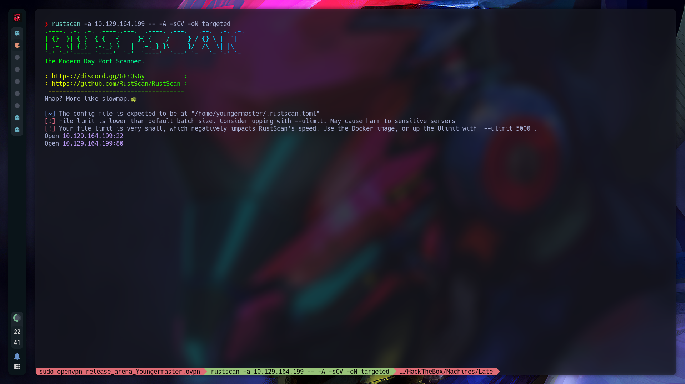

```metadata
{
    "cover": "../../app/assets/sources/Banner-HTB-Late.png",
    "tag": "HTB",
    "title": "Late - Hack The Box",
    "pined": true,
    "size": "large"
}
```

## Reconnaissance

First we *[enum](https://en.wikipedia.org/wiki/Network_enumeration)* the machine, in this case I’ll be using `[rustscan](https://github.com/RustScan/RustScan)`:

```bash
rustscan -a 10.129.164.199 -- -A -sCV -oN targeted
```



We got these two ports (`22`, `80`):


Let’s checkout the page:


Now in the *contact* section we can try to insert `javascript` code: 


Unfortunately we got nothing. First go to edit the `/etc/hosts` and let’s add our `machine IP` given and the `late.htb` next to it. After let’s search for virtual hosts with `[wfuzz](https://www.kali.org/tools/wfuzz/)`, let’s run this command:

```bash
wfuzz -c -u http://${YOUR_IP} -w /usr/share/dirbuster/directory-list-lowercase-2.3-medium.txt -H 'Host: FUZZ.late.htb'
```

We will be seeing a lot of stuff, but let’s test the `images` virtual host:


Now we go to edit the `/etc/hosts` and let’s add our `IP` given and the `late.htb images.late.htb`:


Why `late.htb`? You can add whatever name you want, but I think is more clean to use the name of the machine and the *.htb* at the end.

Now if we go to [`http://images.late.htb/`](http://images.late.htb/), we get this `Flask` page:


Ok, I’ll use this ***“Pure Text”*** image to test out the program, and I got this `results.txt`


Let’s open that `results.txt` to get more info.

We find out something interesting, we got back some `HTML` tags... And also we know that this web page uses `Flask`, and how `Flask` renders HTML?

The short answer is `Jinja2`, but if you want to learn more about it, this is the official documentation:

[Templates - Flask Documentation (2.1.x)](https://flask.palletsprojects.com/en/2.1.x/templating/)


## Enumerate Target Vulnerabilities

Now let’s search a way to *inject* something or *Bypass* the web page. Searching a little bit, I found out this repository with amazing examples (I recommend to read how is it done):

[PayloadsAllTheThings/Server Side Template Injection at master · swisskyrepo/PayloadsAllTheThings](https://github.com/swisskyrepo/PayloadsAllTheThings/tree/master/Server%20Side%20Template%20Injection#jinja2)

Now let’s test it with a simple instruction, let’s upload this image to see if `Flask` executes the expression.


**Nice!** We got the expression to be executed:


## Compromise Targets

Now let’s try a more complex expression, let’s upload this image if we list the `ssh keys` of that user:

> *Note: If you want to know the user, just replace what is in quotes with `whoami`, and you get the user, in this case we got `svc_acc`.*
> 


We got the following files, and there is a interesting key (`id_rsa`):


Now let’s send this image to get the `ssh key` to get access to *`svc_acc`:*


**V*oilá***, we got a key***:***


Now let’s copy the content in a file an let’s assign the correct permissions and we can connect to it:

```bash
# We assign the permissions
chmod 600 ${YOUR_KEY_NAME}
# We will connect to it
ssh svc_acc@late.htb -i ${YOUR_KEY_NAME}
```

Let’s get the user flag:


## Privilege Escalation

We can use *[linpeas.sh](https://github.com/carlospolop/PEASS-ng/)* to get more info, but first we should upload it to the machine, search for your `tun0 IP` and start a `Python web server` where is located the *linpeas.sh* file. It should look like this:


Inside the *Late machine* we get the file with `wget` and we add the permissions to execute the files with `chmod +x ./linpeas.sh`:


After that just run it with `./linpeas.sh`, we will get a bunch of information, however we will be using the file `/usr/local/sbin/ssh-alert.sh`:


Let’s open it (`vim /usr/local/sbin/ssh-alert.sh`) to understand how we can *“hack it”*.


We got some interesting insights, when someone logins through *ssh*, it will send a mail to the *root* user. Also we discover it has some special permissions, the aim of that is to be able to write in *“protected”* places.


Let’s ***exploit it!*** I found out a simple way to do it:

- First we open two shells and we log in one of them.


- Where we are logged, we run the following commands:

```bash
# We copy the root in our directory
echo "cp /root/root.txt /home/svc_acc/root.txt"  >> /usr/local/sbin/ssh-alert.sh
# We add our user as the owner of the file
echo "chown svc_acc:svc_acc /home/svc_acc/root.txt" >> /usr/local/sbin/ssh-alert.sh
```

- Then we rapidly go to the other shell, we log in and let’s see what we got:


***Voilá, we got the Root!***

But how? Well, we know that the script `/usr/local/sbin/ssh-alert.sh` has some special permissions (that’s why we add those two commands), also we know that every time that we log in with SSH the script will run (that’s why we open two terminals to log in again), so when we log in again the commands that were added previously gonna run.